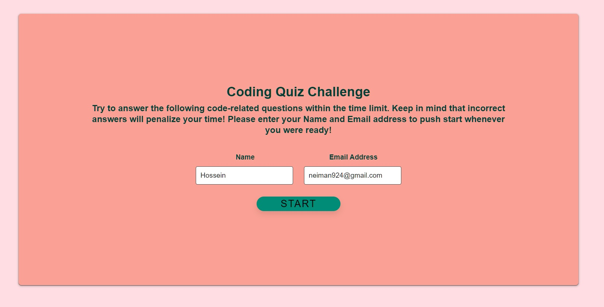

# Code Quiz

##
Timed coding quiz with multiple-choice questions. This app will run in the browser and will feature dynamically updated HTML and CSS powered by JavaScript code. 
This is the first page asking user to enter his information, if after finishing the quiz asking for the information, if user had a bad experience with the quiz not gonna enter the requested information:

After entering the information the information is gonna save as a localstorage and if user wanted to repeat the quiz app going to fill the information from localstorage.

as soon as starting the quiz timer is gonna start to work and is going to show a timer bar on top of the page, if user refresh the page time is still constant and after a second timebar is going to refresh itself:

with any wrong answer an alert gonna tell the user made a wrong choise and it is going to affect the time and timer bar:

after finishing the test, app is going to display this window to tell the user how many time this quiz is repeated and its going to show how many correct and wrong answer they had: 


## I reached the Acceptance Criteria

```
Quiz starting with clicking the start button
Timer start and user presenting with a question
after answering a question
user presenting with another question
WHEN user answering a question incorrectly
Time is subtracted from the clock
WHEN all questions are answered or the timer reaches 0
THEN the quiz is over
and user can see the result of the quiz
```
